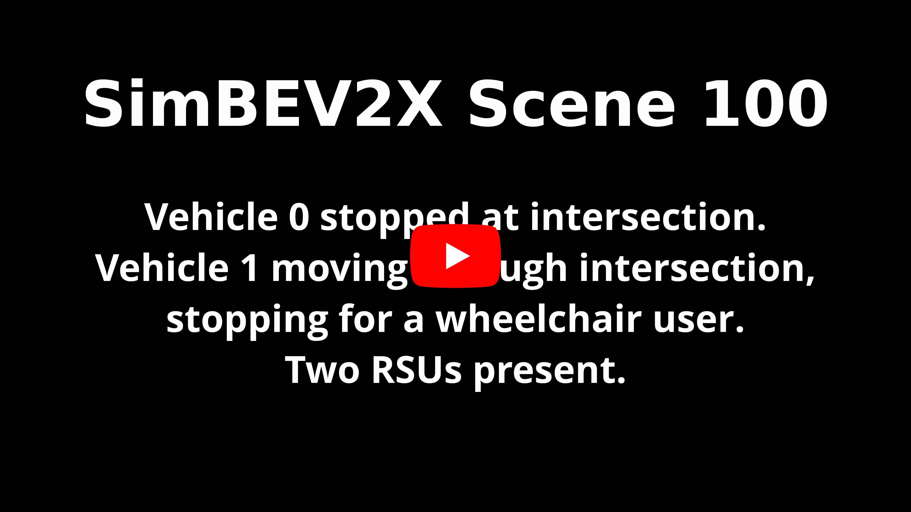
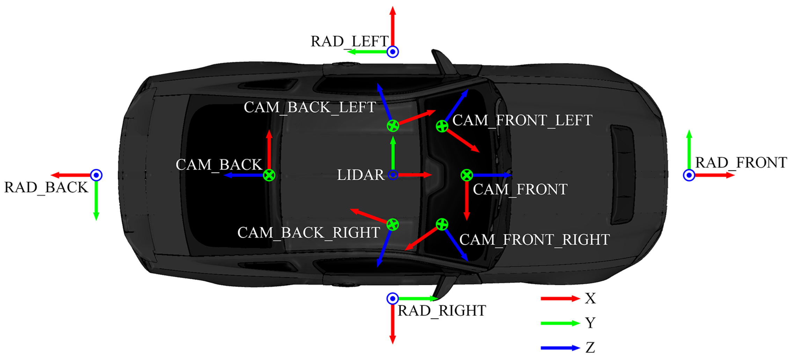
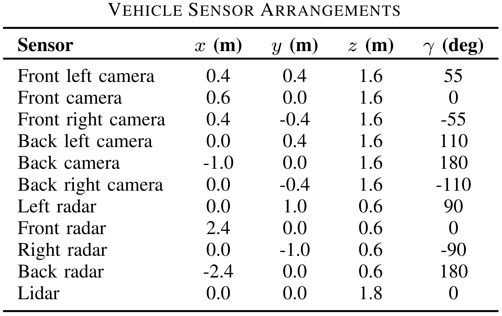
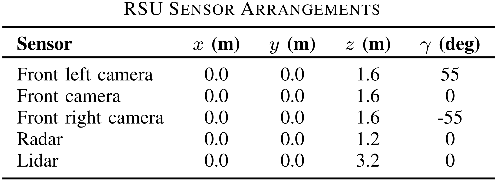
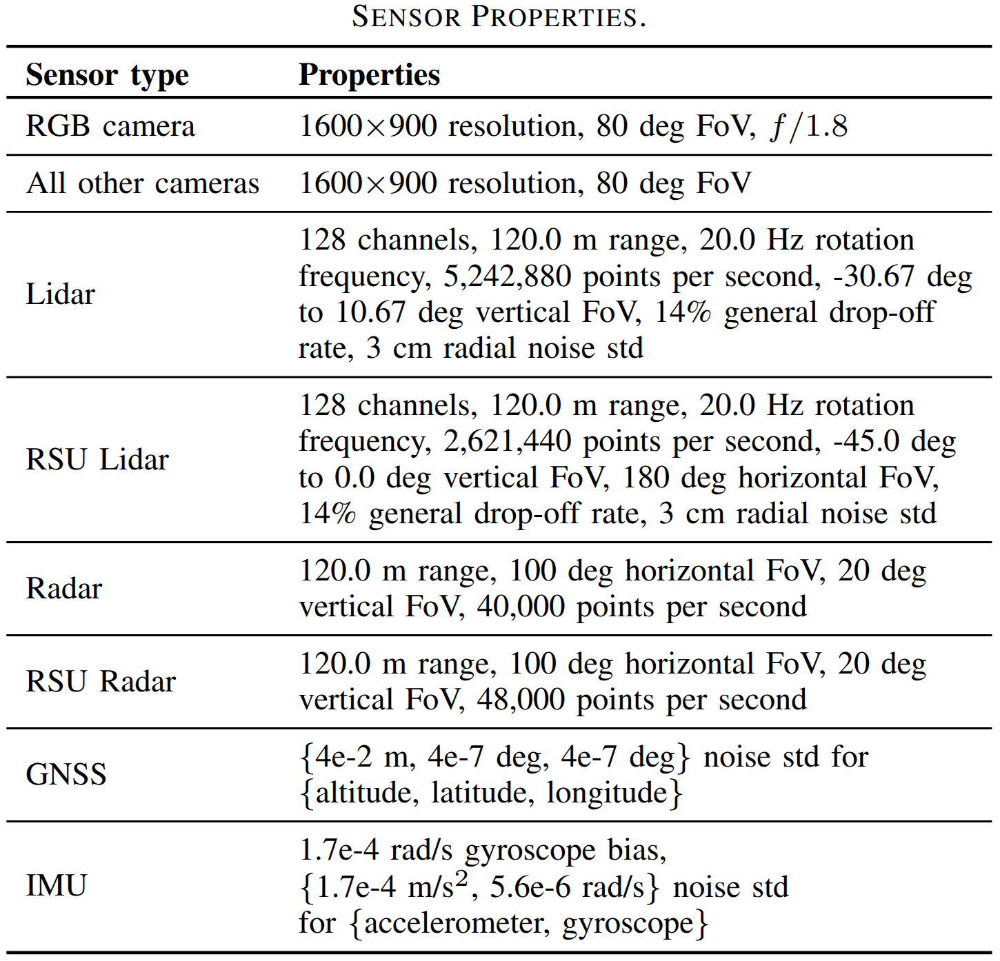

# <p align="center"> SimBEV2X: A Large-Scale Dataset and Data Generation Tool for Multi-Task Vehicle-to-Everything Cooperative Perception </p>

<p align="center">
  <a href="https://arxiv.org/abs/2607.23910" alt="SimBEV2X Paper">
      </a>
  <a href="https://drive.google.com/drive/folders/1HVlrp_SrEdSbzj8-BLEFdNtcrp03bXGr?usp=sharing" alt="SimBEV2X Dataset">
      </a>
  <a href="https://simbev2x.org" alt="SimBEV2X Project Page">
      </a>
  <a href="https://youtu.be/4Qg5DRScysw" alt="SimBEV2X Video">
      </a>
</p>
<p align="center">
  <a href="https://scholar.google.com/citations?user=zXkVUDgAAAAJ">Goodarz Mehr<sup>1</sup></a>, <a href="https://scholar.google.com/citations?user=2VK13N8AAAAJ">Sepideh Gohari<sup>1</sup></a>, <a href="https://scholar.google.com/citations?user=CM6t9yYAAAAJ">Montasir Abbas<sup>2</sup></a>, <a href="https://scholar.google.com/citations?user=sHS8o8oAAAAJ">Azim Eskandarian<sup>1</sup></a>
<br>
<sup>1</sup>Virginia Commonwealth University, <sup>2</sup>Virginia Tech
</p>

<div align="center">
  <a href="https://youtu.be/4Qg5DRScysw">
    
  </a>
</div>

<!-- ## News
**[2025/12/12]** SimBEV2X coming soon...

**[2025/12/12]** SimBEV 3.0 is released, with support for new 3D and BEV classes, randomly-generated hazard areas, an interactive visualizer, and more. SimBEV Dataset v2 coming soon...
<p align="middle">
  
  
  
  
  
  
</p>

**[2025/8/15]** SimBEV 2.0 is released, with support for new 3D and BEV classes, continuous weather shifts, and more.

<p align="middle">
  
  
</p> 
<p align="middle">
  
 
 
</p> 

**[2025/4/15]** [Our implementation](https://github.com/GoodarzMehr/UniTR) of [UniTR](https://github.com/Haiyang-W/UniTR) trained on the SimBEV dataset is released.

**[2025/2/9]** [Our implementation](https://github.com/GoodarzMehr/bevfusion) of [BEVFusion](https://github.com/mit-han-lab/bevfusion) trained on the SimBEV dataset is released.

**[2025/2/6]** Initial release of dataset, code, and paper. -->

## About

SimBEV2X is an advanced vehicle-to-everything synthetic data generation tool built on the CARLA simulator. SimBEV2X is based on [SimBEV](https://github.com/GoodarzMehr/SimBEV) and automatically creates highly randomized driving scenarios to collect rich multi-modal sensor data alongside various types of ground truth, including 3D object bounding boxes with unique track IDs, HD map information, BEV segmentation maps, and 3D semantic occupancy voxel grids from both vehicles and road-side units (RSUs).

We used SimBEV2X to create the SimBEV2X Dataset, the largest V2X perception dataset to date. The dataset comprises 258 scenes, each involving up to 8 connected vehicles and up to 4 RSUs across a variety of road networks. The SimBEV2X Dataset is an order of magnitude larger than existing V2X datasets and contains 102,200 frames, 588,520 lidar point clouds, more than 3 million images, over 27 million object bounding boxes, and a comprehensive set of BEV segmentation maps and 3D semantic occupancy voxel grids. An example scene from the SimBEV2X dataset is shown below.

<div align="center">
  <a href="https://youtu.be/8lrSr5WIQYo">
    
  </a>
</div>

**Note: the dataset may be subject to small changes.**

## Installation

### Hardware Requirements

We developed and tested SimBEV2X on a system with the following specifications:
* AMD Ryzen 9 9950X (Any Intel 9th Gen or newer or Ryzen 7/9 3rd Gen or newer will probably work)
* 96 GB RAM (32 GB is probably enough)
* Nvidia GeForce RTX 4090
* Ubuntu 22.04

To run SimBEV2X, your system must satisfy CARLA 0.9.16's [minimum system requirements](https://github.com/carla-simulator/carla/tree/ue4-dev?tab=readme-ov-file#recommended-system).

### CARLA

**To run SimBEV2X, you must use our custom version of CARLA** (built from source from [this fork](https://github.com/GoodarzMehr/carla/tree/ue4-dev-local) of the `ue4-dev` branch). **Please download it from [here](https://drive.google.com/file/d/1YbajnYo52_OYoJFoCmXABxs7ILDzj_wi).**

**We have not tested SimBEV2X with the standard version of CARLA 0.9.16 or CARLA 0.10.0 and advise against using them with SimBEV2X. CARLA 0.9.16 is incompatible with SimBEV2X and while CARLA 0.10.0 offers superior graphics, it lacks some features from the UE4-based CARLA that SimBEV2X relies on (e.g. customizable weather, large maps, etc.) We will make SimBEV2X available for CARLA 0.10.\* when it reaches feature parity with the UE4-based CARLA.**

To learn more about how our custom version of CARLA differs from CARLA 0.9.16 see [here](https://github.com/GoodarzMehr/SimBEV#carla).

### SimBEV2X

We recommend using SimBEV2X with Docker. The base Docker image is Ubuntu 22.04 with CUDA 13.2.1 and Vulkan SDK 1.3.204. If you want to use a different base image, you may have to modify `ubuntu2204/x86_64` when fetching keys on line 61 of the [Dockerfile](Dockerfile), based on your Ubuntu release and system architecture.

1. Install [Docker](https://docs.docker.com/engine/install/) on your system.
2. Install the [Nvidia Container Toolkit](https://docs.nvidia.com/datacenter/cloud-native/container-toolkit/install-guide.html#installation-guide). It exposes your Nvidia graphics card to Docker containers.
3. Clone this repository:
   ```Bash
   git clone https://github.com/GoodarzMehr/SimBEV2X.git && cd SimBEV2X
   ```
4. Download the SimBEV2X Docker image:
   ```Bash
   docker pull goodarzm/simbev2x:cuda-13.2.1-devel-ubuntu-22.04
   ```
   Alternatively, build the SimBEV2X Docker image (this will take several minutes):
   ```Bash
   docker build --no-cache --rm --build-arg ARG -t simbev2x:develop .
   ```
   The following optional build arguments (`ARG`) are available:
   * `USER`: username inside each container, set to _sb_ by default.
   * `CARLA_VERSION`: installed CARLA version, set to _0.9.16_ by default.
5. Launch a container:
   ```Bash
   docker run --runtime=nvidia --privileged --gpus all --network=host -e DISPLAY=$DISPLAY \
   -v [path/to/CARLA]:/home/carla \
   -v [path/to/SimBEV2X]:/home/simbev2x \
   -v [path/to/dataset]:/dataset \
   --shm-size 32g -it simbev2x:[tag] /bin/bash
   ```
   Use `nvidia-smi` to ensure your graphics card(s) is (are) visible inside the container. Use `vulkaninfo --summary` to ensure Vulkan can see your graphics card(s).
6. Install CARLA inside the container by running:
    ```Bash
    pip install carla/PythonAPI/carla/dist/carla-0.9.16-cp310-cp310-linux_x86_64.whl
    ```
7. In a separate terminal window, enter the container as the root user by running `docker exec -it -u 0 [container name] /bin/bash`. Then, run:
    ```Bash
    cd simbev2x && python setup.py develop
    ```
    Exit the container as the root user but stay inside it as the _sb_ (non-root) user.

If you would like to use SimBEV2X without Docker, you can install the dependencies using the [requirements](requirements.txt) file, then install [SimBEV](https://github.com/GoodarzMehr/SimBEV) using
```Bash
FORCE_CUDA=1 pip install --no-cache-dir git+https://github.com/GoodarzMehr/SimBEV.git@main
```
and then follow steps 6 and 7 above.

## Usage

### Creating/Expanding a SimBEV2X Dataset

Use the [config.yaml](configs/config.yaml) file to configure SimBEV2X's behavior (for a detailed explanation of available parameters see the [sample_config.yaml](configs/sample_config.yaml) file). Set `mode` in the [config.yaml](configs/config.yaml) file to `create` to create a new SimBEV2X dataset. If a SimBEV2X dataset already exists (in the path provided by `path`), SimBEV2X compares the number of existing and desired scenes for each map and creates additional ones if necessary. This feature can be used to continue creating a dataset in the event of a crash or expand an already existing one. Now, run
```Bash
simbev2x configs/config.yaml [options]
```
`options` can be any of the following:
* `--path`: path for saving the dataset (`/dataset` by default).
* `--render`: visualize captured sensor data.
* `--save`: save captured sensor data (used by default).
* `--no-save`: do not save captured sensor data.

For instance,
```Bash
simbev2x configs/config.yaml --render --no-save
```
visualizes sensor data as it is being captured without saving it.

You can pause/resume the simulation at any time by pressing _F9_. You can press the 0-9 keys to place the spectator behind the data collection vehicle of the same index.

### Replacing Scenes

If you would like to replace a number of existing scenes, set `mode` in the [config.yaml](configs/config.yaml) file to `replace` and specify the list of scenes that should be replaced using the `replacement_scene_config` field.

### Replaying/Augmenting Scenes

If you would like to replay/augment a number of existing scenes, set `mode` in the [config.yaml](configs/config.yaml) file to `replay` and specify the list of scenes that should be replayed using the `replay_scene_config` field. SimBEV2X will use the saved CARLA log file of the specified scenes to replay them. This can be useful if you want to collect additional data from a scene. For example, if you have already collected RGB camera data and would like to collect semantic lidar and radar data when replaying the scene, set `use_rgb_camera` and `use_rsu_rgb_camera` fields in the [config.yaml](configs/config.yaml) file to `False` and set `use_semantic_lidar`, `use_rsu_semantic_lidar`, `use_radar`, and `use_rsu_radar` to `True`. Just note that because the riders of motorcycles and bicycles are selected at random by UE4 each time, it will be different when replaying the scene, but this is usually a very small discrepancy and everything else in the replayed scene should exactly match the original scene.

### Post-processing

An optional post-processing step will - for each data collection vehicle and RSU (entity) - calculate the number of lidar and radar points inside each 3D object bounding box collected for said entity (0 for all objects if that data is not collected) alongside a _valid_ flag indicating whether the object is fully occluded (False) or visible to the entity (True). By default, an object is _valid_ if the number of points inside its bounding box is non-zero and _invalid_ otherwise. However, if instance segmentation images have been collected, the `--use-seg` argument can be used to use those images to assist in determining the validity of objects (if the number of points inside the object's bounding box is zero but the object is visible in an image, then it is _valid_). The post-processing step also determines the detection difficulty of an object (either _easy_, _medium_, or _hard_) based on the object's class, distance to the entity, and the number of points inside its bounding box. This information will be appended to bounding box data. Finally, the post-processing step combines the bounding boxes collected by each entity in the scene into a unified list of unique bounding boxes distinguished by object ID, where the number of lidar and radar points for each object are summed for all entities and an object is _valid_ if it is observed by at least one entity. This unified list of unique object bounding boxes is stored separately.

If 3D semantic occupancy data have been collected, since in many cases such voxels represent only the surface shell of objects, the post-processing step can also fill in the semantic label of voxels inside those objects.

To post-process the data, in the [simbev2x](simbev2x) directory run
```Bash
simbev2x-postprocess [options]
```
`options` can be any of the following:
* `--path`: path for saving the dataset (`/dataset` by default).
* `--process-bbox`: post-process 3D object bounding boxes (used by default).
* `--no-process-bbox`: do not post-process 3D object bounding boxes.
* `--numpy-backwards-compatible`: make 3D object detection ground truth backward compatible with NumPy 1.x by saving it as a `.json` file (if data is collected using NumPy 2.x).
* `--use-seg`: use instance segmentation images to help with post-processing 3D object bounding boxes.
* `--fill-voxels`: post-process 3D semantic occupancy data.
* `--morph-kernel-size`: kernel size used for morphological closing (3 by default).
* `--num-gpus`: number of GPUs used for post-processing 3D semantic occupancy data (-1, i.e. all available GPUs, by default).

The post-processing step will create a new `det` folder under `ground-truth` (see [Data Format](#data-format) for more information) and move the files of the original `det` folder to a new `old_det` folder. It will also update the info files, but will keep the old ones with `_unprocessed` appended to the file name.

### Data Visualization

To visualize certain types of collected data (those that are not readily visualized, e.g. semantic segmentation images are already in `.png` format), run
```Bash
simbev2x-visualize [mode] [options]
```

Setting mode to `interactive-single` launches SimBEV2X's single-entity interactive visualizer for point cloud (lidar, semantic lidar, radar) and voxel data, allowing the user to evaluate and inspect data for each scene, frame, and entity, as shown below:

https://github.com/user-attachments/assets/bd939224-c238-4e4a-b887-cfc56ac8fa99

Setting mode to `interactive-multi` launches SimBEV2X's multi-entity interactive visualizer for lidar and radar data, allowing the user to visualize data from all agents for each scene and frame, as shown below:

https://github.com/user-attachments/assets/fcb5fbfc-9847-4d4b-a42d-3a6375b80b06

For all other modes, a new `viz` folder in the dataset's path is created where the visualizations are stored. Visualizations involving 3D object bounding boxes require data to be post-processed first. Mode can be `rgb`, `depth`, `flow`, `lidar`, `lidar-with-bbox`, `lidar3d`, `lidar3d-with-bbox`, `semantic-lidar`, `semantic-lidar3d`, `radar`, `radar-with-bbox`, `radar3d`, `radar3d-with-bbox`, `voxel3d`, and `all` (every mode listed above except the interactive modes). For more information about these modes see [here](https://github.com/GoodarzMehr/SimBEV#data-visualization).

Visualization modes involving point clouds or voxels have two default views, `NEAR` and `FAR`, as defined in the [visualization_handlers](simbev2x_tools/visualization_handlers.py) file, where you can also define your custom view if needed.

`options` can be any of the following:
* `--path`: path to the dataset (`/dataset` by default).
* `-s`, `--scene`: list of scene numbers to visualize, can be individual numbers or a range (-1, i.e. all scenes, by default).
* `-f`, `--frame`: list of frame numbers to visualize, can be individual numbers or a range (-1, i.e. all frames, by default).
* `--ignore-valid-flag`: display all 3D bounding boxes regardless of the value of their _valid_ flag.
* `--filled-voxels`: display post-processed semantic occupancy voxel grids.
* `--black-background`: use a black background instead of the default white background.

For instance, using
```Bash
simbev2x-visualize rgb depth lidar3d semantic-lidar radar-with-bbox --scene 0 12 27-32 --frame 3 30-49 300
```
visualizes RGB images with 3D bounding boxes overlaid, depth images, lidar point clouds from a 3D perspective view, semantic lidar point clouds from a top-down view, and radar point clouds from a top-down view with 3D bounding boxes overlaid for frames 3, 30 to 49, and 300 of scenes 0, 12, and 27 to 32.

### Using the SimBEV2X Dataset

Consult the dataloader provided in the [dataloader_sample](dataloader_sample) folder - used as part of a multi-agent implementation of [BEVFusion](https://github.com/GoodarzMehr/bevfusion) - to learn how to use the SimBEV2X Dataset.

## Data Format

### Sensor Setup

<p align="middle">
  
</p>
<table>
  <tr>
    <td width="48.8%">
      
      <br />
      
    </td>
    <td>
      
    </td>
  </tr>
</table>

###### <p align="center"> Coordinate values are relative to a FLU (Front-Left-Up) coordinate system. For a data collection vehicle, the origin of this coordinate system is the center of the ground plane of its 3D bounding box. For an RSU, it is the base of its pole. </p>


Sensors in SimBEV2X are referenced using the `{subtype}-{position}` format (which turns into `{position}` when subtype is not available). For cameras, subtype can be one of `RGB` (RGB camera), `SEG` (semantic segmentation camera), `IST` (instance segmentation camera), `DPT` (depth camera), or `FLW` (optical flow camera), while position can be one of `CAM_FRONT_LEFT`, `CAM_FRONT`, `CAM_FRONT_RIGHT`, `CAM_BACK_RIGHT`, `CAM_BACK`, `CAM_BACK_LEFT`. For instance, `DPT-CAM_BACK_LEFT` denotes the back left depth camera. For lidar, since there is only one position, regular lidar is denoted by `LIDAR`, while semantic lidar is denoted by `SEG-LIDAR`. For radar, subtype is not available and position can be one of `RAD_LEFT`, `RAD_FRONT`, `RAD_RIGHT`, `RAD_BACK`. GNSS and IMU are simply denoted as `GNSS` and `IMU`, respectively. The voxel detector is denoted as `VOXEL-GRID`, and the post-processed 3D semantic occupancy data is denoted as `VOXEL-GRID-FILLED`.

### Folder Structure

A generic SimBEV2X dataset uses the following folder structure.
```
simbev2x/
|
├── configs/
|
├── console_logs/
|
├── ground-truth/
|   ├── combined_det/ (if 3D object bounding boxes are post-processed)
|   ├── vehicle-0/
|   |   ├── det/
|   |   ├── old_det/ (if 3D object bounding boxes are post-processed)
|   |   ├── seg/
|   |   ├── seg_viz/
|   |   ├── hd_map/
|   ├── vehicle-1/
|   ...
|   ├── rsu-0/
|   ...
|
├── infos
|   ├── simbev2x_infos_train.json
|   ├── simbev2x_infos_val.json
|   ├── simbev2x_infos_test.json
|   ├── simbev2x_infos_train_unprocessed.json (if 3D object bounding boxes are post-processed)
|   ├── simbev2x_infos_val_unprocessed.json (if 3D object bounding boxes are post-processed)
|   ├── simbev2x_infos_test_unprocessed.json (if 3D object bounding boxes are post-processed)
|
├── logs/
|
├── scenario_images/
|
├── sweeps/
|   ├── vehicle-0/
|   |   ├── RGB-CAM_FRONT_LEFT/
|   |   ├── RGB-CAM_FRONT/
|   |   ...
|   |   ├── SEG-CAM_FRONT_LEFT/
|   |   ├── SEG-CAM_FRONT/
|   |   ...
|   |   ├── IST-CAM_FRONT_LEFT/
|   |   ├── IST-CAM_FRONT/
|   |   ...
|   |   ├── DPT-CAM_FRONT_LEFT/
|   |   ├── DPT-CAM_FRONT/
|   |   ...
|   |   ├── FLW-CAM_FRONT_LEFT/
|   |   ├── FLW-CAM_FRONT/
|   |   ...
|   |   ├── LIDAR/
|   |   ├── SEG-LIDAR/
|   |   ├── RAD_LEFT/
|   |   ├── RAD_FRONT/
|   |   ...
|   |   ├── GNSS/
|   |   ├── IMU/
|   |   ├── VOXEL-GRID/
|   |   ├── VOXEL-GRID-FILLED/ (if semantic occupancy data is post-processed)
|   ├── vehicle-1/
|   ...
|   ├── rsu-0/
|   ...
|
├── viz/ (if data is visualized)
```


<details>
<summary><h4>configs</h4></summary>

Contains the config files, one for each scene, with the files using the `SimBEV2X-scene-{scene number}.yaml` naming scheme. The files are usually identical, unless the dataset was expanded or some scenes were replaced or replayed using a different configuration. If an existing scene is replayed, the new config file will use the `SimBEV2X-scene-{scene number}-replay-{i}.yaml` naming scheme, where `i` is the index of the replay attempt (i.e. `i` is 0 for the first attempt, 1 for the second attempt, etc.).

</details>

<details>
<summary><h4>console_logs</h4></summary>

Contains the logging output to the console/terminal.

</details>

<details>
<summary><h4>ground-truth</h4></summary>

Contains the ground truth files for each frame, with the files using the `SimBEV2X-scene-{scene number}-frame-{frame number}-{entity}-{entity number}-{type}.{data type}` naming scheme. `entity` is either `vehicle` or `rsu`. For the `det`, `seg`, `seg_viz`, and `hd_map` folders, `type` and `data type` are `GT_DET` and `bin`; `GT_SEG` and `npz`; `GT_SEG_VIZ` and `jpg`; and `HD_MAP` and `json`, respectively.

The `det` folder for each entity contains the ground truth files (3D object bounding boxes and associated data) for that entity for each frame. In each file, the following information is provided for each object:
* `id`: object ID supplied by CARLA
* `type`: object type, e.g. `vehicle.ford.mustang_2016` or `walker.pedestrian.0051`
* `is_alive`: True if the object is alive, False if destroyed
* `is_active`: True if the object is active, False otherwise
* `is_dormant`: True if the object is dormant, False otherwise
* `parent`: ID of the parent object if one exists, `None` otherwise
* `attributes`: object attributes, e.g. `has_lights`, `color`, `role_name`, etc. for a car
* `semantic_tags`: object semantic tags
* `bounding_box`: global coordinates of the corners of the object's 3D bounding box
* `location`: location ($x$, $y$, $z$) of the object (in a right-handed coordinate frame)
* `rotation`: rotation (roll, pitch, yaw) of the object (in a right-handed coordinate frame)
* `linear_velocity`: linear velocity of the object (m/s)
* `angular_velocity`: angular velocity of the object (deg/s)
* `distance_to_ego`: distance of the object from the entity (m)
* `angle_to_ego`: angle of the object to the entity (deg, entity's front vector is 0, positive CCW)
* **[requires post processing]** `num_lidar_pts`: number of lidar points inside the object's 3D bounding box
* **[requires post processing]** `num_radar_pts`: number of radar points inside the object's 3D bounding box
* **[requires post processing]** `valid_flag`: True if the object is visible to the entity, False otherwise
* **[requires post processing]** `class`: class of the object
* **[requires post processing]** `difficulty`: detection difficulty of the object, can be _easy_, _medium_, or _hard_
* **[traffic light only]** `green_time`: duration the traffic light stays green (s)
* **[traffic light only]** `yellow_time`: duration the traffic light stays yellow (s)
* **[traffic light only]** `red_time`: duration the traffic light stays red (s)
* **[traffic light only]** `state`: current state of the traffic light (i.e. green, yellow, or red)
* **[traffic light only]** `opendrive_id`: OpenDRIVE ID of the traffic light
* **[traffic light only]** `pole_index`: index of the traffic light's pole whitin the traffic light group
* **[traffic sign only]** `sign_type`: traffic sign's type, if it can be extracted from CARLA; generally `stop`, `yield`, or `speed_limit`; in Town12, Town13, and Town15 the speed limit is provided as well, e.g. `speed_limit_30` (30 km/h speed limit) or `speed_limit_55_min_40` (55 km/h speed limit, 40 km/h minimum speed limit)

The `seg` folder for each entity contains the BEV ground truth files for that entity for each frame. BEV ground truth is a binary $C \times d \times d$ array, where $C$ is the number of classes and $d$ is the dimension of the BEV grid (400 for the SimBEV2X dataset). The BEV ground truth contains 14 classes, which in order are `road`, `hazard`, `road_line`, `sidewalk`, `crosswalk`, `traffic_cone`, `barrier`, `car`, `truck`, `bus`, `motorcycle`, `bicycle`, `rider`, `pedestrian`. The second and third dimensions of the array increase along the $-x$ and $-y$ axes of the entity's FLU coordinate system, respectively.

The `seg_viz` folder for each entity contains the visualization of the BEV ground truth for that entity for each frame.

The `hd_map` folder for each entity contains information about the waypoint at the entity's location for each frame, which, when combined wih the map's OpenDRIVE data should provide accurate map information about the area around the entity. The following information is provided for each waypoint:
* `id`: waypoint ID supplied by CARLA
* `s`: distance along the road section
* `road_id`: OpenDRIVE ID of the road the waypoint belongs to
* `section_id`: OpenDRIVE ID of the road section the waypoint belongs to
* `lane_id`: OpenDRIVE ID of the lane the waypoint belongs to
* `lane_type`: type of the lane the waypoint belongs to, should be `Driving` but other possible values include `Sidewalk`, `Shoulder`, `Curb`, etc.
* `lane_width`: width of the lane the waypoint belongs to
* `lane_change`: type of lane change permitted by the lane
* `is_junction`: whether the waypoint is in a junction
* `junction_id`: OpenDRIVE ID of the junction if the waypoint is in a junction
* `is_intersection`: whether the waypoint is in an intersection
* `transform`: global coordinate transform (location, rotation) of the waypoint
* `left/right_lane_marking`: information about the left/right lane markings, includes `type` (e.g. `Solid`, `Broken`, `SolidBroken`, etc.), `width`, `color`, and `lane_change`
* `left/right_lane`: information about the corresponding waypoint in the left/right lane, includes `id`, `s`, `road_id`, `section_id`, `lane_id`, `lane_type`, `lane_width`, and `lane_change`

</details>

<details>
<summary><h4>infos</summary></h4>

Contains the info files, one for each data split, with the files using the `simbev2x_infos_{split}.json` naming scheme where `split` is either `train`, `val`, or `test`. Each file is comprised of `metadata` and `data`. `metadata` contains coordinate transformation matrices for all sensors (i.e. `sensor2lidar_translation`, `sensor2lidar_rotation`, `sensor2ego_translation`, and `sensor2ego_rotation`) for both data collection vehicles and RSUs, as well as the camera intrinsics matrix and voxel detector properties. `data` contains scene information, divided into `scene_info` and `scene_data` for each scene. `scene_info` includes the overall scene information, while `scene_data` provides information about individual frames, including file paths for collected sensor data and the corresponding ground truth.

A sample info file has the following format:
```
"metadata":
...
"data": {
    "scene_0000": {
        "scene_info": {
            "map": "Town01",
            "vehicle_0": {
                "vehicle": "vehicle.ford.mustang_2016",
                "reckless_ego": false,
                "distracted_ego": false
            },
            "vehicle_1": {
                "vehicle": "vehicle.toyota.supra",
                "reckless_ego": false,
                "distracted_ego": false
            },
            ...
            "rsu_0": {},
            "rsu_1": {},
            ...
            "scene_duration": 12,
            "seed": 27,
            "dynamic_weather": true,
            "initial_weather_parameters": {
                "cloudiness": 30.640047073364258,
                "precipitation": 0.0,
                "precipitation_deposits": 7.157243251800537,
                "wind_intensity": 79.58255767822266,
                "sun_azimuth_angle": 13.52698040008545,
                "sun_altitude_angle": 33.679325103759766,
                "wetness": 3.443225145339966,
                "fog_density": 0.0,
                "fog_distance": 100.0,
                "fog_falloff": 1.0
            },
            "final_weather_parameters": {
                ...
            },
            "street_light_intensity_change": 0.0,
            "n_accident_hazards": 0,
            "n_road_work_hazards": 3,
            "n_reckless_vehicles": 5,
            "n_distracted_vehicles": 2,
            "traffic_parameters": {
                "speed_difference": null,
                "distance_to_leading": null,
                "green_time": null,
                "walker_cross_factor": 0.6629090689429323
            },
            "n_vehicles": 139,
            "n_walkers": 237,
            "log": "/dataset/simbev2x/logs/SimBEV2X-scene-0000.log",
            "config": "/dataset/simbev2x/configs/SimBEV2X-scene-0000.yaml"
        },
        "scene_data": {
            "vehicle_0": [
                {
                    "ego2global_translation": [
                        396.3190612792969,
                        -61.92582321166992,
                        -0.008468427695333958
                    ],
                    "ego2global_rotation": [
                        0.7099432854499794,
                        0.0030819533376744146,
                        -0.003068200268907304,
                        0.7042454253704622
                    ],
                    "timestamp": 42628157569,
                    "RGB-CAM_FRONT_LEFT": "/dataset/simbev2x/sweeps/vehicle-0/RGB-CAM_FRONT_LEFT/SimBEV2X-scene-0000-frame-0000-vehicle-0000-RGB-CAM_FRONT_LEFT.jpg",
                    "IST-CAM_FRONT_LEFT": "/dataset/simbev2x/sweeps/vehicle-0/IST-CAM_FRONT_LEFT/SimBEV2X-scene-0000-frame-0000-vehicle-0000-IST-CAM_FRONT_LEFT.png",
                    ...
                    "RAD_LEFT": "/dataset/simbev2x/sweeps/vehicle-0/RAD_LEFT/SimBEV2X-scene-0000-frame-0000-vehicle-0000-RAD_LEFT.npz",
                    ...
                    "LIDAR": "/dataset/simbev2x/sweeps/vehicle-0/LIDAR/SimBEV2X-scene-0000-frame-0000-vehicle-0000-LIDAR.npz",
                    "GNSS": "/dataset/simbev2x/sweeps/vehicle-0/GNSS/SimBEV2X-scene-0000-frame-0000-vehicle-0000-GNSS.bin",
                    "IMU": "/dataset/simbev2x/sweeps/vehicle-0/IMU/SimBEV2X-scene-0000-frame-0000-vehicle-0000-IMU.bin",
                    "VOXEL-GRID": "/dataset/simbev2x/sweeps/vehicle-0/VOXEL-GRID/SimBEV2X-scene-0000-frame-0000-vehicle-0000-VOXEL-GRID.npz",
                    "VOXEL-GRID-FILLED": "/dataset/simbev2x/sweeps/vehicle-0/VOXEL-GRID-FILLED/SimBEV2X-scene-0000-frame-0000-vehicle-0000-VOXEL-GRID-FILLED.npz",
                    "GT_SEG": "/dataset/simbev2x/ground-truth/vehicle-0/seg/SimBEV2X-scene-0000-frame-0000-vehicle-0000-GT_SEG.npz",
                    "GT_SEG_VIZ": "/dataset/simbev2x/ground-truth/vehicle-0/seg_viz/SimBEV2X-scene-0000-frame-0000-vehicle-0000-GT_SEG_VIZ.jpg",
                    "GT_DET": "/dataset/simbev2x/ground-truth/vehicle-0/det/SimBEV2X-scene-0000-frame-0000-vehicle-0000-GT_DET.bin",
                    "HD_MAP": "/dataset/simbev2x/ground-truth/vehicle-0/hd_map/SimBEV2X-scene-0000-frame-0000-vehicle-0000-HD_MAP.json",
                    "scene": 0,
                    "frame": 0,
                    "GT_DET_COMBINED": "/dataset/simbev2x/ground-truth/combined_det/SimBEV2X-scene-0000-frame-0000-GT_DET_COMBINED.bin"
                },
                ...
            ],
            ...
            "rsu-0": [
                ...
            ],
            ...
        }
    }
    "scene_0001": {
        ...
    },
    ...
}
```

</details>

<details>
<summary><h4>logs</summary></h4>

Contains the log files, one for each scene, with the files using the `SimBEV2X-scene-{scene number}.log` naming scheme. Log files can be used by SimBEV2X to replay scenes and collect additional data.

</details>

<details>
<summary><h4>scenario_images</summary></h4>

Contains overhead images of the starting position of data collection vehicles, one for each scene, with the files using the `Scene_{scene number}.jpg` naming scheme.

</details>

<details>
<summary><h4>sweeps</summary></h4>

Contains collected sensor data for each entity and each frame, with the files using the `{entity}/{sensor}/SimBEV2X-scene-{scene number}-frame-{frame number}-{entity}-{entity number}-{sensor}.{type}` naming scheme. For instance, back left RGB camera image for vehicle 2 in frame 12 of scene 27 is saved as `vehicle-2/RGB-CAM_BACK_LEFT/SimBEV2X-scene-0027-frame-0012-vehicle-0002-RGB-CAM_BACK_LEFT.jpg`. We briefly discuss how each sensor's data is saved below. See [CARLA's sensors documentation](https://carla.readthedocs.io/en/latest/ref_sensors/) for more details.
* RGB camera: images are saved as `.jpg` files.
* Semantic segmentation camera: images are saved as `.png` files.
* Instance segmentation camera: images are saved as `.png` files.
* Depth camera: images are saved as `.png` files.
* Optical flow camera: images are saved as a $(h, w, 2)$ NumPy array where $h$ and $w$ are the image height and width, respectively.
* Lidar: point clouds are saved as a $(n, 3)$ NumPy array where the columns represent the $x$, $y$, and $z$ values, respectively.
* Semantic lidar: point clouds are saved as a $(n, 6)$ NumPy array where the columns represent the $x$, $y$, and $z$ values, cosine of the incidence angle, and the index and semantic tag of the hit object, respectively.
* Radar: point clouds are saved as a $(n, 4)$ NumPy array where the columns represent the depth, altitude angle, azimuth angle, and velocity, respectively.
* GNSS: data is saved as a \[latitude, longitude, altitude\] Numpy array.
* IMU: data is saved as a \[ $\dot{x}$, $\dot{y}$, $\dot{z}$, $\dot{\phi}$, $\dot{\theta}$, $\dot{\psi}$, $\psi$\] NumPy array.
* Voxel detector: data is saved as a $(d, w, h)$ NumPy array where the dimensions represent the $x$, $y$, and $z$ directions of the vehicle's FLU coordinate system, respectivelly. Each cell contains the semantic (class) label of the object that overlaps with that cell, unless the cell is unoccupied, in which case its value is 0.

</details>

## SimBEV2X Dataset Benchmarks

Models are trained on the SimBEV2X Dataset's _train_ set and evaluated on its _test_ set. For all models, lidar point clouds are down-sampled to represent a 32-beam lidar. **The results are preliminary and subject to small changes.**

### 3D Object Detection

| Model         | Modality |  mAP (%) |  mATE (m) | mAOE (rad) |      mASE | mAVE (m/s) |  SDS (%) |      FPS | VRAM (GB) |
| :---------:   | :------: | :------: | :-------: | :--------: | :-------: | :--------: | :------: | :------: | :-------: |
| BEVFusion-C   |        C |     25.8 |     0.797 |      0.481 |     0.250 |      1.210 |     31.3 | **30.1** |   **3.4** |
| CoopDet3D-C   |        C |     24.2 |     0.801 |      0.577 |     0.261 |      1.248 |     29.1 |     27.2 |       3.9 |
| CoBEVFusion-C |        C |     11.1 |     0.848 |      0.650 |     0.282 |      1.352 |     20.8 |     23.2 |       3.9 |
| BEVFusion-L   |        L |     63.9 |     0.272 |      0.353 |     0.205 |      0.373 |     66.9 |      6.7 |      13.8 |
| CoopDet3D-L   |        L |     74.1 |     0.288 |      0.339 |     0.194 |      0.373 |     72.1 |      6.4 |      14.8 |
| CoBEVFusion-L |        L |     76.1 |     0.255 |  **0.303** |     0.198 |      0.349 |     74.2 |      5.2 |      15.2 |
| BEVFusion     |    C + L |     65.4 |     0.300 |      0.384 |     0.236 |      0.403 |     66.2 |      5.9 |      15.7 |
| CoopDet3D     |    C + L |     74.2 |     0.289 |      0.323 | **0.191** |      0.364 |     72.5 |      5.4 |      16.2 |
| CoBEVFusion   |    C + L | **76.2** | **0.247** |      0.306 |     0.196 |  **0.333** | **74.6** |      4.6 |      16.8 |


### BEV Segmentation

| Model         | Modality | mIoU@0.5 (%) | mIoU@0.7 (%) | mIoU@0.9 (%) | mIoU < 20 m (%) | mIoU 20 - 40 m (%) | mIoU > 40 m (%) |      FPS | VRAM (GB) |
| :---------:   | :------: | :----------: | :----------: | :----------: | :-------------: | :----------------: | :-------------: | :------: | :-------: |
| BEVFusion-C   |        C |         21.0 |         16.7 |         10.5 |            32.2 |               21.2 |            12.6 | **37.5** |   **3.4** |
| CoopDet3D-C   |        C |         20.4 |         15.9 |          9.9 |            28.6 |               20.3 |            14.5 |     32.7 |       3.9 |
| CoBEVFusion-C |        C |         21.0 |         16.7 |         10.3 |            30.5 |               21.0 |            14.1 |     27.1 |       3.9 |
| BEVFusion-L   |        L |         40.0 |         29.1 |         15.1 |            52.5 |               43.5 |            27.2 |      7.0 |      13.6 |
| CoopDet3D-L   |        L |         41.8 |         29.0 |         13.6 |            50.0 |               44.6 |            33.0 |      6.9 |      14.2 |
| CoBEVFusion-L |        L |         45.0 |         34.2 |         20.6 |            52.0 |               47.9 |            36.9 |      6.2 |      14.2 |
| BEVFusion     |    C + L |         43.1 |         32.1 |         18.0 |            55.5 |               46.8 |            30.5 |      6.2 |      15.4 |
| CoopDet3D     |    C + L |         42.6 |         30.2 |         15.5 |            50.6 |               45.2 |            34.1 |      5.9 |      16.5 |
| CoBEVFusion   |    C + L |     **47.4** |     **36.2** |     **22.5** |        **56.3** |           **50.0** |        **38.5** |      5.5 |      16.4 |

## Acknowledgement

SimBEV2X is based on [CARLA](https://carla.org/) and we are grateful to the team that maintains it. SimBEV2X has also taken inspiration from the [nuScenes](https://www.nuscenes.org/), [SHIFT](https://www.vis.xyz/shift/), [OPV2V](https://mobility-lab.seas.ucla.edu/opv2v/), [V2X-Sim](https://ai4ce.github.io/V2X-Sim/index.html), and [TUMTraf](https://tum-traffic-dataset.github.io/tumtraf-v2x/) datasets, as well as [Co3SOP](https://github.com/tlab-wide/Co3SOP).

The sixth generation Ford Mustang model is based on [this](https://www.blenderkit.com/asset-gallery-detail/342206ad-9e8e-4cfc-add0-8007dc86fdbb/) BlenderKit model by Kentik Khudosovtsev.

Hazard area static props are based on [this](https://www.fab.com/listings/6426cc8a-2410-45be-b3ce-edfea87d09cc) Roadside Construction asset by Quixel Megascans.

## Citation

If SimBEV2X is useful or relevant to your research, please kindly recognize our contributions by citing our paper:
```bibtex
@article{mehr2026simbev2x,
  title={SimBEV2X: A Large-Scale Dataset and Data Generation Tool for Multi-Task Vehicle-to-Everything Cooperative Perception},
  author={Mehr, Goodarz and Gohari, Sepideh and Abbas, Montasir and Eskandarian, Azim},
  journal={arXiv preprint arXiv:2607.23910},
  year={2026}
}
```
